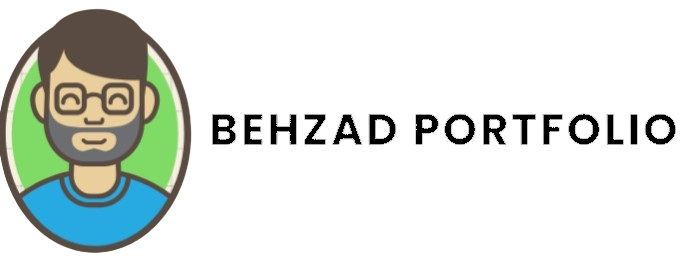

<h1 align="center">Hi 👋, I'm Behzad Rajabalipour</h1>
<h3 align="center">A passionate, creative, responsible & fast Front-end and Back-End developer.</h3>

<h3 align="left">Connect with me:</h3>
<p align="left">
<a href="https://www.linkedin.com/in/behzad-rajabalipour/" target="blank"></a>
<a href="mailto:your-email@gmail.com" target="blank"></a>
<a href="https://behzadportfolio.com/" target="blank"></a>
</p>

### 🛠 My Faviorite Languages & Tools

&nbsp;
&nbsp;
&nbsp;
&nbsp;
&nbsp;
&nbsp;

&nbsp;
&nbsp;

&nbsp;
&nbsp;

&nbsp;
&nbsp;

&nbsp;
&nbsp; 

&nbsp;

&nbsp;
&nbsp;

&nbsp;
&nbsp;
&nbsp;


---

## My Portfolio

### Please take a moment to explore my portfolio.

[](https://behzadportfolio.com)

```javascript
const Behzad = {
  Developer: "Behzad Rajabalipour",
  Pronouns: "he | him",
  Languages: [Javascript, TypeScript, Python, C++, C#, PHP, Java, HTML, CSS, Node.js],
  Automation: ["Terraform", "Ansible", "GitHub Action", "CloudFormation"],
  Container Orchestration: ["Kubernetes", "Docker"],
  Technologies: {
    Framework: ["React", "Asp.net", "Django"], 
    IDE: ["Visual Studio Code", "IntelliJ IDEA", "Eclipse"],
    ApiTools: "Postman",
    CloudComputing: ["Amazon Web Services(AWS)", "Azure"],
    VCS: {
      git: [Gitlab, GitHub]
    },
    frontEnd: {
      CSS: ["Bootstrap", "Tailwind CSS", "SASS"],
      Asynchronous: "Ajax"
    },
    backEnd: {
      js: ["NodeJs", "TypeScript"],
      Database: ["MySQL", "MSSQL", "Oracle", "MongoDB"]
    }    
  }
};
```
<p></p>

<p></p>
